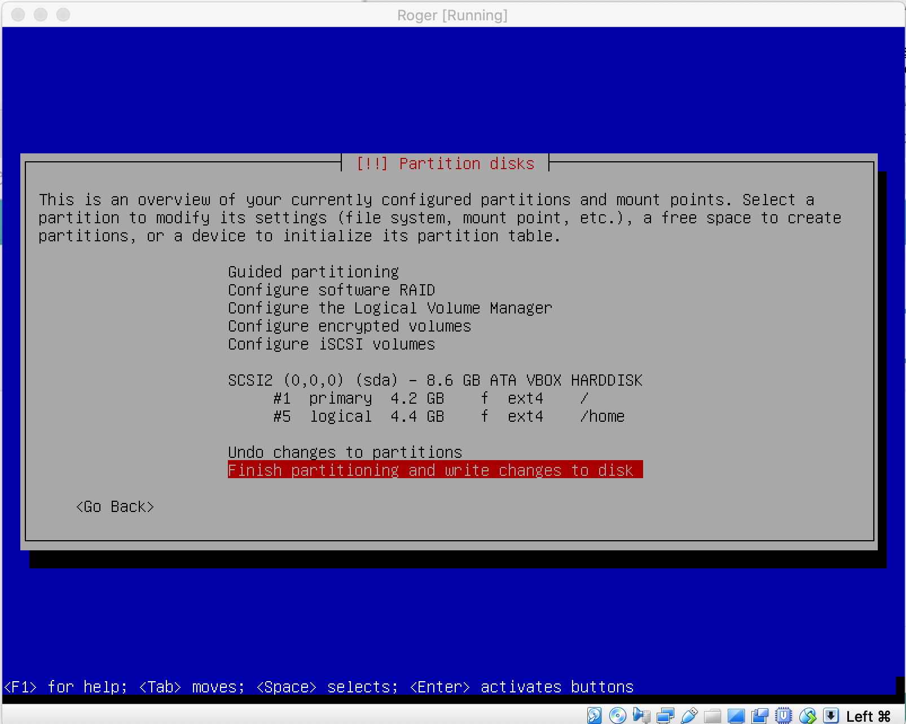
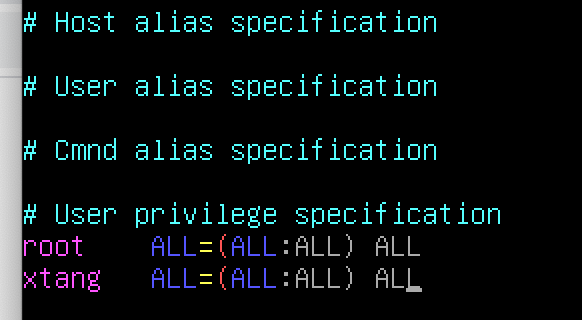

# Roger-Skyline-1

## Mandatory Part

## V.2 VM Part

#### Run a Virtual Machine (VM) 
    Hypervisor: Virtualbox on school Mac
    VM OS: Debian 10
#### A disk size of 8 GB
#### Have at least one 4.2 GB partition.
#### The whole packages to meet the demands and to up to date.
    * Download Debian package from official website
        debian-10.5.0-amd64-netinst.iso
    * install VM
        name: Roger
        RAM: 1024 MB
        Hard disk: 8.00GB VDI Dynamically allocated
                  file located at /goinfre/xtang/Roger.vdi
    * install Debian OS on VM
        Hostname: Roger
        Account_1: name: root
                   password: XXXXXXXXX
        Account_2: full name: Xing Tang
                   name:xtang
                   password:XXXXXXX
        Partition disks: Manual

    * Install the GRUB boot loader Yes
    * logon one with account xtang
        $> su    logn on as root
        #> apt update
        #> apt upgrade

    * The command to show disk
        $>sudo df -h
        $>sudo fdisk
    
## V.3 Network and Security Part

#### You must create a non-root user to connect to the machine and work

    *non-root user: xtang was created during OS installation.

    * add a new users: tommi
        $>sudo useradd -m  tommi
        $>sudo passwd tommi
        password: XXXXXXXX
        Check the home folder
        $>ls -la /home/

-----------------------------------------------------
#### Use sudo, with this user, to be able to perform operation requiring special rights. 

    * inastall sudo and add users
        #>apt install sudo
        (#>apt install vim)
        #>vim /etc/sudoers

------------------------------------------------------

#### We don't want you to use the DHCP service of your machine. You've got to configure it to have a static IP and a Netmask in \30.

----------VM:Skyline---------------------------------

    $>ifconfig (in host)
    en0: inet 10.13.2.1 broadcast 10.13.255.255

    $>ifconfig (in VM)(old VM static IP, bridge adpter)
    enp0s3: inet 10.13.2.246 netmask 255.255.255.253 broadcast 10.13.2.247

    changed to new static IP, bridge adapter
    enp0s3: inet 10.13.2.248, netmask 255.255.255.252

    *How to know the gateway address
        For VM:
        $>ip route | grep default
  

        For Host(MacOS)
        $>netstat -nr | grep default
        

----------VM:Roger---------------------------------

    $>ifconfig (in host)
    Host IP: en0 inet 10.13.2.3 broadcast 10.13.255.255
    ($>sudo apt install net-tools)
    >sudo ifconfig (in VM)
    VM IP: enp0s3 inet 10.0.2.15 netmask 255.255.255.0 broadcast 10.0.2.255

    * change VM network adapter from NAT to  Bridged Adapter (en0:Ethernet)
    VM IP: eno0s3 10.13.200.77 netmask 255.255.0.0 broadcast 10.13.255.255

    * change /etc/network/interfaces file

    from:
        #The primary network interface            
        allow-hotplug enp0s3                      
        iface enp0s3 inet dhcp

    to:
        #The primary network interface 
        auto enp0s3

    * create a new file /etc/network/interfaces.d/enp0s3

        iface enp0s3 inet static
            address 10.13.2.246
            netmask 255.255.255.252
            gateway 10.13.254.254

    * /30 : 30bit subnet mask  

-------------------------------------------

#### You have to change the default port of the SSH service by the one fo your choice. SSH access HAS TO be down with publickeys. SSH root access SHOULD NOT BE ALLOWED DIRECTLY, but with a user who can be root. 

    * To check ssh service status /restart
      $>sudo service sshd status
      $>sudo service sshd restart

    * To change ssh port (49152 - 65535) in 
       /etc/ssh/sshd_config
        Port 65534 (remove #) 
    
    * SSH access with publickeys.
        to create ssh key pairs in host(it will connect to VM)

        $>ssh-keygen -t rsa

        to copy ssh public key to VM

        $>ssh-copy-id -i id_rsa.pub xtang@10.13.2.246 -p65534

        now you can connect to VM from Host
        $>ssh xtang@10.13.2.246 -p65534

    * To check user root to SSH connect to VM. 

        $>ssh root@10.13.2.246 -p65534
        permission denied, please try again. 

        root user can't login when we install the Debian. 
        
        edit /etc/ssh/sshd_config as following

        PermitRootLogin         no (yes/no/prohibit-password) (remove #)
        PubkeyAuthentication    yes (remove #)
        PasswordAuthentication   no (remove #)
        note: if host id_rsa.pub changed, you have to create a new ssh-keygen again. 

--------------------------------------------------

#### You have to set the rules of your firewall on your server only with the services used outside the VM.

    * install ufw
    $>sudo apt install ufw

    * check status of Firewall
    $>sudo ufw status

    * to enable Firewall
    $>sudo ufw enable

    * setup firewall rules
    $>sudo ufw allow 65534/tcp (for ssh port)
    $>sudo ufw allow 80/tcp (for http )
    $>sudo ufw allow 443 (for https)

----------------------------------------------------

#### You have to set a DOS(Denial Of Service Attack) protection on your open ports of your VM.

    *To check current status
        $>sudo service fail2ban status

-----------------------------------------------------------
    * install git on VM
    $>sudo apt install git

    * make a Slow Loris attack to www.tangxing.tk (personal blog)

    $>git clone https://github.com/gkbrk/slowloris.git
    $>python slowloris.py  10.13.2.246

      * Fail2Ban to defence to DOS(Denial of Service Attack)

    $>sudo apt install fail2ban

    * To modify /etc/fail2ban/jail.local
    $>sudo cp /etc/fail2ban/jail.conf /etc/fail2ban/jail.local

    * install iptables
    $>sudo apt install iptables

    * install apache2
    $>sudo apt install apache2

    * Active fail2ban
    $>sudo ufw reload
    $>sudo service fail2ban restart (stop)

    $>sudo fail2ban-client status

    ??? How to check the fail2ban is working.

------------------------------------------
https://www.vultr.com/docs/how-to-setup-fail2ban-on-debian-9-stretch

#### You have to set a protection against scans on your VM's open ports.

    *$> sudo apt install portsentry

    * modify /etc/default/portsentry like this.

    * modify /etc/portsentry/portsentry.conf 

    * In above file, it is only one KILL_ROUTE is working.
    the commands to help you to c heck the settings.
    $> cat portsentry.conf | grep KILL_ROUTE | grep -v "#"

    * restart the service
    $>sudo /etc/init.d/portsentry start

    the logs in /var/log/syslog.

    To protect against the scan of ports with portsentry

-------------------------------------------------------

#### Stop the services you don't need for this project.

    before and after reboot, the services are same.

    * stop the following service
     $>sudo systemctl disable keyboard-setup.service

    !!!!!!!! stop do it!!!!!
    $>sudo systemctl disable syslog.service
    !!!!!!!!!stop do it !!!!!

     $>sudo systemctl disable console-setup.service
     $>sudo systemctl disable apt-daily.timer
     $>sudo systemctl disable apt-daily-upgrade.timer

------------------------------------

#### Create a script that updates all the sources of packages, then your packages and which logs the whole in a file named /var/log/update_script.log. Create a scheduled task for this script once a week at 4AM and every time the machine reboots.

    * create a shell file (update.sh)
    $>touch updated.sh      (-rw- r-- r--)
    $>chmod a+x updated.sh (-rwx r-x r-x) 

    * create a crontab file
        $>sudo crontab -e

    usefully link for crontab 
    https://crontab.guru/#0_4_*_*_MON

    * reboot VM and check /var/log/updated_script.log file

----------------------------------------------------------

#### Make a script to monitor changes of the /etc/crontab file and sends an email to root if it has been modified. Create a scheduled scripit task everyday at midnight.

    * To create a mail server
        $>sudo apt install mailutils

    * To check received mails
    $>mailx

    * to create a script 
    $>vim monitor.sh

    

## Optional Part

## VI.1 Web Part

You have to set a web server who should BE available on the VM's IP or an host (init.login.com for example). About the package of your web server, you can choose between Nginx and Apache. You have to set a self-signed SSL on all of your services. 

you have to set a web "application" from those choices:

    A login page.
    A display site.
    A wonderful website tht blow our minds.

    The web-app Could be written with any language you want.

    * copy my html file by github.
    $>sudo apt install git
    And modify file name from mendeleev.html to index.html.
    put the file into /var/www/html/

    SSL 
    https://www.digitalocean.com/community/tutorials/how-to-create-a-self-signed-ssl-certificate-for-apache-in-ubuntu-16-04

    * 1 create the OpenSSL keys
        $>sudo openssl req -x509 -nodes -days 365 -newkey rsa:2048 -keyout /etc/ssl/private/apache-selfsigned.key -out /etc/ssl/certs/apache-selfsigned.crt

    * 2 create a strong Diffie-Hellman group
        $>sudo openssl dhparam -out /etc/ssl/certs/dhparam.pem 2048

    * 3 Create an Apache Configuration Snippet with Strong Encryption Settings
        $>sudo vim /etc/apache2/conf-available/ssl-params.conf

    * 4 Modify the Default Apache SSL Virtual Host File
        backup deaault-ssl.conf
        $>sudo cp /etc/apache2/sites-available/default-ssl.conf /etc/apache2/sites-available/default-ssl.conf.bak
        $>sudo nano /etc/apache2/sites-available/default-ssl.conf

    * 5 Modify the Unencrypted Virtual Host File to Redirect to HTTPS
        $>sudo nano /etc/apache2/sites-available/000-default.conf
        <VirtualHost *:80>
        . . .
        Redirect permanent "/" "https://10.13.2.246/"
        . . .
        </VirtualHost>

    * 6 Enable the Changes in Apache
        $>sudo a2enmod ssl
        $>sudo a2enmod headers
        $>sudo a2ensite default-ssl
        $>sudo a2enconf ssl-params

        Command  to check sytax errors
        $>sudo apache2ctl configtest
        Restart apache
        $>sudo systemctl restart apache2

    * 7 test ENcryption

    https://10.13.2.246 in broswer
 
 

    Redirection from http:// to https://
    http://10.13.2.246

## VI.2 Deloyment Part

    Propose a functional solution for deployment automation.

## Submission and peer-evaluation

    A checksum of your disk image. 
    shasum < disk.vi
        *In host terminal 
         goto /Users/xtang/goinfre/Roger.vdi
        $> shasum < Roger.vdi > shasum.txt