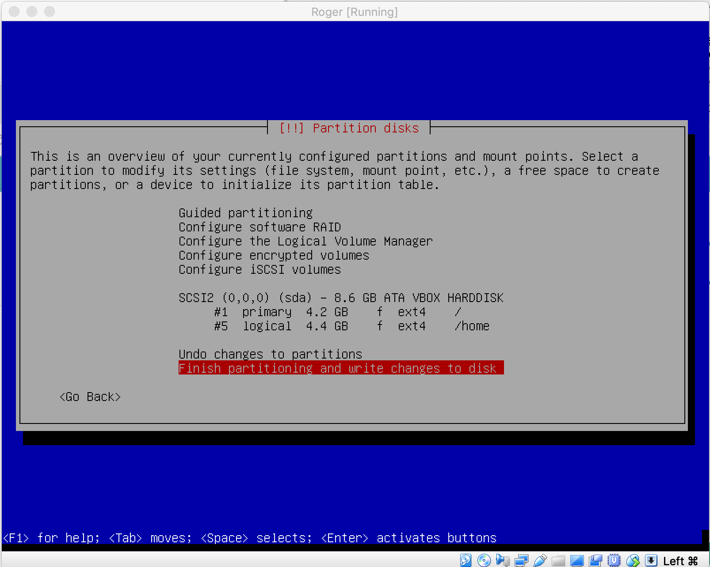
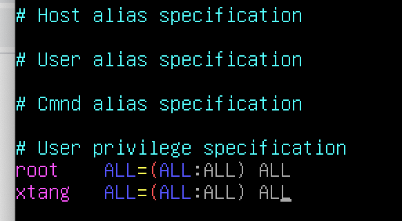

# Roger-Skyline-1

## Mandatory Part

## V.1 Be More than friends!
    Slash16 Done!
## V.2 VM Part

#### Run a Virtual Machine (VM) 
    Hypervisor: Virtualbox at school Mac
    VM OS: Debian
#### A disk size of 8 GB
#### Have at least one 4.2 GB partition.
#### The whole packages to meet the demands and to up to date.
    * Download Debian package from official website
        debian-10.5.0-amd64-netinst.iso
    * install VM
        name: Roger
        RAM: 1024 MB
        Hard disk: 8.00GB VDI Dynamically allocated
                  file located at /goinfre/xtang/Roger.vdi
    * install Debian OS on VM
        Hostname: Roger
        Domain name: tangxing.tk
        Account_1: name: root
                   password: A0517052a
        Account_2: full name: Xing Tang
                   name:xtang
                   password:A0517052
        Partition disks: Manual

    * Install the GRUB boot loader Yes
    * long one with account xtang
        $> su    logn on as root
        #> apt update
        #> apt upgrade

## V.3 Network and Security Part

#### You must create a non-root user to connect to the machine and work

    non-root user: xtang was created during OS installation.

#### Use sudo, with this user, to be able to perform operation requiring special rights. 

    #>apt install sudo
    (#>apt install vim)
    #>vim /etc/sudoers

#### We don't want you to use the DHCP service of your machine. You've got to configure it to have a static IP and a Netmask in \30.
    >ifconfig (in host)
    Host IP: en0 inet 10.13.2.3 broadcast 10.13.255.255
    ($>sudo apt install net-tools)
    >sudo ifconfig (in VM)
    VM IP: enp0s3 inet 10.0.2.15 netmask 255.255.255.0 broadcast 10.0.2.255

    change VM network adapter from NAT to  Bridged Adapter (en0:Ethernet)
    VM IP: eno0s3 10.13.200.77 netmask 255.255.0.0 broadcast 10.13.255.255

    * change /etc/network/interfaces file

    from:
    #The primary network interface            
    allow-hotplug enp0s3                      
    iface enp0s3 inet dhcp

    to:
    #The primary network interface 
    auto enp0s3

    * create a new file /etc/network/interfaces.d/enp0s3

    iface enp0s3 inet static
        address 10.13.2.246
        netmask 255.255.255.252
        broadcst 10.13.254.254

#### You have to change the default port of the SSH service by the one fo your choice. SSH access HAS TO be down with publickeys. SSH root access SHOULD NOT BE ALLOWED DIRECTLY, but with a user who can be root. 

    * To check ssh service status /restart
      $>sudo service sshd status
      $>sudo service sshd restart

    * To change ssh port (49152 - 65535) in 
       /etc/ssh/sshd_config
        Port 65534 (remove #) 
1010    
    * SSH access with publickeys.
        to create ssh key pairs in host(it will connect to VM)

        $>ssh-keygen -t rsa

        to copy ssh public key to VM

        $>ssh-copy-id -i id_rsa.pub xtang@10.13.200.77 -p 65534

        now you can connect to VM from Host
        $>ssh xtang@10.13.200.77 -p65534

    * To check user root to SSH connect to VM. 

        $>ssh root@10.13.200.77 -p65534
        permission denied, please try again. 

        root user can't login when we install the Debian. 
        
        edit /etc/ssh/sshd_config as following

        PermitRootLogin         no (yes/no/prohibit-password) (remove #)
        PubkeyAuthentication    yes (remove #)
        PasswordAuthentication   no (remove #)
        
#### You have to set the rules of your firewall on your server only with the services used outside the VM.

    * install ufw
    $>sudo apt install ufw

    * check status of Firewall
    $>sudo ufw status

    * to enable Firewall
    $>sudo ufw enable

    * setup firewall rules
    $>sudo ufw allow 65534/tcp (for ssh port)
    $>sudo ufw allow 80/tcp (for http )
    $>sudo ufw allow 443 (for https)

#### You have to set a DOS(Denial Of Service Attack) protection on your open ports of your VM.

reffence bbehm/roger-skyline-1 in github

        

